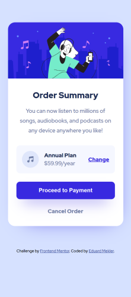

# Frontend Mentor - Order summary card solution

This is a solution to the [Order summary card challenge on Frontend Mentor](https://www.frontendmentor.io/challenges/order-summary-component-QlPmajDUj). Frontend Mentor challenges help you improve your coding skills by building realistic projects. 

## Table of contents

- [Overview](#overview)
  - [The challenge](#the-challenge)
  - [Screenshot](#screenshot)
  - [Links](#links)
- [My process](#my-process)
  - [Built with](#built-with)
  - [What I learned](#what-i-learned)
  - [Continued development](#continued-development)
  - [Useful resources](#useful-resources)
- [Author](#author)

## Overview

### The challenge

Users should be able to:

- See hover states for interactive elements

### Screenshot

### Links

- Solution URL: [GitHub](https://github.com/emekler0729/fem-order-summary-component)
- Live Site URL: [GitHub Pages](https://emekler0729.github.io/fem-order-summary-component/)

## My process

### Built with

- Semantic HTML5 markup
- CSS3 custom properties
- Flexbox
- Mobile-first workflow

### What I learned

#### Removing Default Space Below Image

To avoid having a small margin below an image that is inside of a wrapping element, make the image `display: block` instead of the default `display: inline-block`.

### Continued development

While I was able to add a basic box-shadow to the call-to-action button and the card element, I felt that my box-shadow was not as refined as the design example. I researched and used box-shadows examples that I found on the internet (documented below). For future development, I will study design best practices for box-shadows.

### Useful resources

- [Smoother Box Shadows](https://tobiasahlin.com/blog/layered-smooth-box-shadows/) - This helped me improve the appearance of my box-shadows on the call-to-action button and card components.

## Author

- Website - [Eduard Mekler](https://www.github.com/emekler0729)
- Frontend Mentor - [@emekler0729](https://www.frontendmentor.io/profile/emekler0729)
